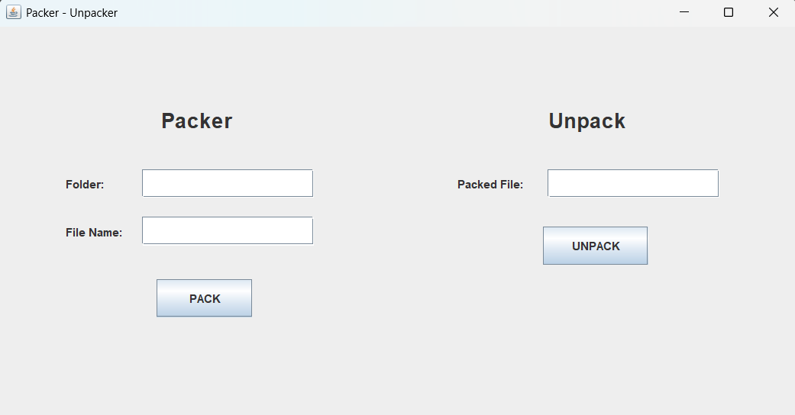
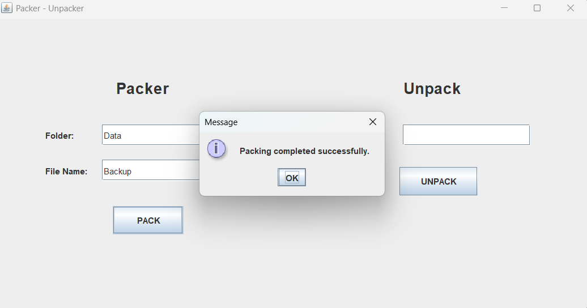
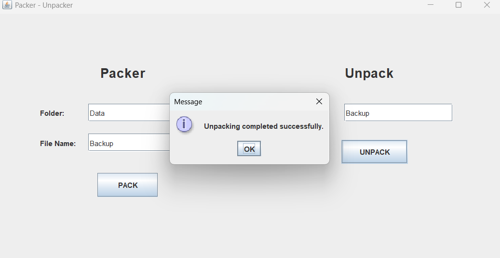

# Packer-Unpacker

A Java-based file packing and unpacking application with a graphical user interface for combining multiple files into a single packed file and extracting them when required.

## Features

* Pack multiple files into a single packed file.
* Unpack files from a packed file.
* Graphical User Interface for easy interaction.
* Handles file reading and writing using Java I/O.
* Separates packing, unpacking, and GUI functionality into independent classes.

## Tech Stack

* **Language:** Java
* **Core Concepts:** OOP, File Handling, Exception Handling
* **GUI:** Java GUI
* **I/O:** Java File I/O
* **Tools:** VS Code, Git, GitHub

## Project Architecture

```text
              Packer-Unpacker
                     |
             PackerUnpackerGUI
                /          \
               /            \
          Packer          Unpacker
             |                |
             ↓                ↓
       Packed File       Extracted Files
```

### Components

* **Packer.java** — Handles the file packing operation.
* **Unpacker.java** — Handles the file extraction/unpacking operation.
* **PackerUnpackerGUI.java** — Provides the graphical interface and connects user actions with the packing/unpacking functionality.

## Project Structure

```text
Packer-Unpacker/
│
├── src/
│   ├── Packer.java
│   ├── Unpacker.java
│   └── PackerUnpackerGUI.java
│
├── screenshots/
│   ├── main-gui.png
│   ├── packing.png
│   └── unpacking.png
│
├── README.md
└── .gitignore
```

## How It Works

### Packing

```text
Select Files
     ↓
GUI
     ↓
Packer
     ↓
Read File Information & Data
     ↓
Create Packed File
```

### Unpacking

```text
Select Packed File
       ↓
      GUI
       ↓
    Unpacker
       ↓
Read Stored File Information & Data
       ↓
Extract Original Files
```

## How to Run

### Prerequisites

* Java JDK installed
* Git installed

Check Java:

```bash
java -version
javac -version
```

### Clone Repository

```bash
git clone https://github.com/YOUR-USERNAME/Packer-Unpacker.git
cd Packer-Unpacker
```

### Compile

```bash
javac *.java
```

### Run

```bash
java PackerUnpackerGUI
```

## Screenshots

### Application GUI



### Packing



### Unpacking



## Future Improvements

* Improve GUI design and user experience.
* Add progress indicators for large file operations.
* Improve validation and exception handling.
* Add compression to reduce packed file size.
* Add optional encryption for secure file storage.

## Author

**Yash Patil**

Computer Science & Engineering (Data Science)

[GitHub](https://github.com/Yashec21) • [LinkedIn](https://www.linkedin.com/in/yashpatilec/)
